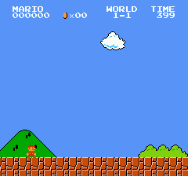

# Super Mario Bros, solved by search



The whole game, 1-1 to Bowser's axe, found by a C++ search on the real game in 45 minutes on
one machine: **4:31.7 of game time** (16,328 frames), shown here at 8x speed.
[Full video, real speed](docs/media/full_game.mp4).

| level | route found → optimised (decisions) | time in level |
|---|---|---|
| 1-1 | 522 → 396 | 26.3 s |
| 1-2 (warp zone → world 4) | 736 → 289 | 26.9 s |
| 4-1 | 495 → 455 | 33.3 s |
| 4-2 (vine → warp zone → world 8) | 800 → 359 | 31.7 s |
| 8-1 | 873 → 625 | 44.8 s |
| 8-2 | 549 → 450 | 32.4 s |
| 8-3 | 459 → 441 | 31.8 s |
| 8-4 (to the axe) | 981 → 632 | 44.5 s |

One decision every 4 frames, from the 12 actions of COMPLEX_MOVEMENT. Times include each
level's intro screen and end sequence.

| 4-2: two hidden blocks, the vine, the warp zone | 8-4: the maze, the water, Bowser |
|---|---|
|  |  |

## How it works

```
level start ─► EXPLORE ─────────────► a route out ─► OPTIMISE ─────────────► fast route ─► next level
               Go-Explore in C++:                    beam A* over time:
               cells of (area, x, y, camera,         nodes ranked by how far along the
               tiles); walk from new cells first;    found route they are; bumped blocks
               keep the fastest state per cell       and grown vines are checkpoints
```

- **Real game.** No emulator shortcuts: pipes, flag sequences and castles play out in full.
- **Verified.** Every route is replayed in [stable-retro](https://github.com/Farama-Foundation/stable-retro),
  the reference emulator: game RAM matches our core on every one of the 16,328 frames.
- **Fast.** A single-purpose NES core (`native/`), 4.6 KB compact savestates, 64 threads:
  ~375k emulated frames per second.
- **No route hints.** It is given only the level order of the warp route (1-1, 1-2, 4-1, 4-2,
  8-1 to 8-4); where the warp zones, the vine and the way through the 8-4 maze are, it found itself.

## Run it

```bash
./setup.sh                      # venv, dependencies, ROM, builds
search/full_game.sh             # search 1-1 -> 8-4, verify, render search/out/e2e/demo.mp4
```

One level: `python search/tools/solve.py --start 4-2 --segments 1 --out search/out/4-2`.
Python API and engine layout: [search/README.md](search/README.md).

## Repository

| path | |
|---|---|
| `search/` | the search engine (C++), its Python interface, tools and checks |
| `native/` | the NES core, a batched renderer, level states, lockstep tests vs stable-retro |
| `retro_integration/` | stable-retro integration for Super Mario Bros (used for verification) |

## Next: SMBZero

A policy network trained from the search (expert iteration: the search teaches the network,
the network guides the search), meant to play on its own even when the game's timing differs
from run to run (random delays at the start shift enemies and the RNG).

The earlier reinforcement-learning attempts (PPO, GRPO, curricula) are in git tag `pre-cleanup`.
