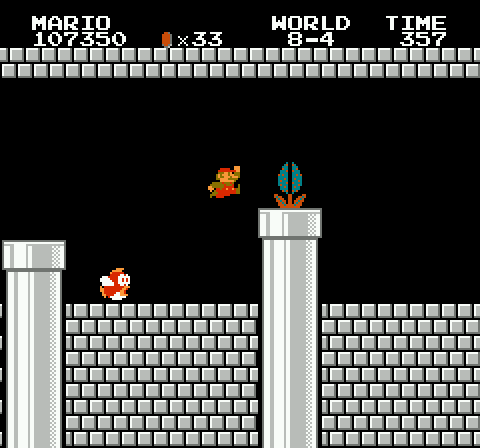
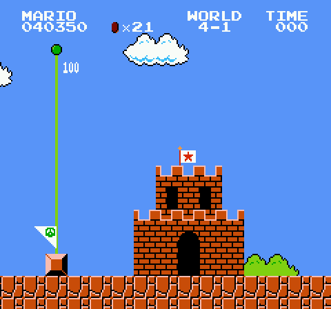
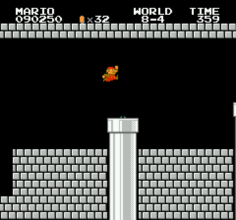

# SMBZero: Super Mario Bros, learned

[](docs/media/smbzero_win.mp4)

A network plus AlphaZero-style tree search that learned Super Mario Bros from a search's
solutions and its own games, with no human knowledge. Its first full game, **1-1 to Bowser's
axe in 5:37.0**, replays frame for frame in stable-retro, the reference emulator.
Above: the last 26 seconds at real speed; click for the whole run
([mp4, real speed](docs/media/smbzero_win.mp4)).

## SMBZero (current stage)

| video (real speed, 50 fps, replayed in stable-retro) | |
|---|---|
| [**1-1 to the axe**](docs/media/smbzero_win.mp4) | the whole game in **5:37.0** (the search below: 5:26.4); one of its own training games, 2000 simulations per move |
| [8-4 to the axe](docs/media/smbzero_8-4.mp4) | its first clear of Bowser's castle (4000 simulations per move) |
| [1-1 to 8-1](docs/media/smbzero_full_game.mp4) | at the live budget (1000 simulations per move): 1-1 to 4-2 in 143.4 s, then stuck in 8-1 |

How it plays, one decision every 4 frames:

```
last 4 frames (84x84) ─► network ─► prior over the 12 actions
                                        │
            MCTS, ~1000 simulations: explore where the prior points, look ahead,
            keep the best line; play the most visited move
```

It learned from the search below (its routes, labels of the states SMBZero itself reached)
and from the visit counts of its own bigger searches.

Does the net matter? The same MCTS (1000 simulations per move, 4 start delays per level),
only the prior changes ([data](docs/smbzero_ablation.json)):

| | 1-1 | 1-2 | 4-1 | 4-2 | 8-1 | 8-2 | 8-3 | 8-4 | total |
|---|---|---|---|---|---|---|---|---|---|
| net prior + MCTS | 4/4 | 4/4 | 4/4 | 4/4 | 4/4 | 3/4 | 4/4 | 1/4 | **28/32** |
| uniform prior + MCTS | 0/4 | 0/4 | 3/4 | 0/4 | 0/4 | 2/4 | 3/4 | 0/4 | 8/32 |
| net alone (no search) | 0/4 | 0/4 | 0/4 | 0/4 | 0/4 | 0/4 | 0/4 | 0/4 | 0/32 |

Where it stands: at the live budget it clears 28 of 32 level runs but no full game yet (8-1
and 8-2 stop it). And two parts still lean on the emulator and the search: the MCTS looks
ahead by stepping the real game from savestates, and scores its leaves by progress along the
search's route. Next ([plan](docs/superpowers/plans/2026-09-21-smbzero-world-model.md)): a
value network, then a learned world model, so that at evaluation the agent touches the game
only by playing it; then no teacher at all.

## The teacher: the whole game by search

The whole game, 1-1 to Bowser's axe, found by a C++ search on the real game in 45 minutes on
one machine: **5:26.4** from first control to the axe (16,324 frames; the ROM is the European
version, a PAL game at 50 fps). [Full video, real speed](docs/media/full_game.mp4).

| level | route found → optimised (decisions) | search | PAL TAS | gap |
|---|---|---|---|---|
| 1-1 | 522 → 396 | 31.7 s | 28.5 s | +3.2 s |
| 1-2 (warp zone → world 4) | 736 → 289 | 32.4 s | 30.2 s | +2.2 s |
| 4-1 | 495 → 455 | 40.0 s | 37.2 s | +2.9 s |
| 4-2 (vine → warp zone → world 8) | 800 → 359 | 38.1 s | 28.0 s | +10.1 s |
| 8-1 | 873 → 625 | 53.8 s | 50.6 s | +3.2 s |
| 8-2 | 549 → 450 | 38.9 s | 35.7 s | +3.2 s |
| 8-3 | 459 → 441 | 38.2 s | 33.1 s | +5.0 s |
| 8-4 (to the axe) | 981 → 632 | 53.4 s | 48.5 s | +4.9 s |
| **total** | | **5:26.4** | **4:51.7** | **+34.7 s** |

One decision every 4 frames, from the 12 actions of COMPLEX_MOVEMENT. Times include each
level's intro screen and end sequence. PAL TAS: HappyLee's
[Super Mario Bros. (Europe) "warps"](https://tasvideos.org/6622M), replayed on this ROM in
stable-retro and timed the same way (the famous 4:54 records are for the NTSC version).

| 4-2: two hidden blocks, the vine, the warp zone (real speed) | 8-4: the maze, the water, Bowser (real speed) |
|---|---|
|  |  |

```
level start ─► EXPLORE ─────────────► a route out ─► OPTIMISE ─────────────► fast route ─► next level
               Go-Explore in C++:                    beam A* over time:
               cells of (area, x, y, camera,         nodes ranked by how far along the
               tiles); walk from new cells first;    found route they are; bumped blocks
               keep the fastest state per cell       and grown vines are checkpoints
```

- **Real game.** No emulator shortcuts: pipes, flag sequences and castles play out in full.
- **Verified.** Every route is replayed in [stable-retro](https://github.com/Farama-Foundation/stable-retro):
  game RAM matches our core on every frame.
- **Fast.** A single-purpose NES core (`native/`), 4.6 KB compact savestates, ~375k emulated
  frames per second on 64 threads.
- **No route hints.** Given only the level order of the warp route; the warp zones, the vine
  and the way through the 8-4 maze it found itself.

## Run it

```bash
./setup.sh                      # venv, dependencies, ROM, builds
search/full_game.sh             # the search: 1-1 -> 8-4, verify, render search/out/e2e/demo.mp4
python -m smbzero.eval --net NET.pt --delays 0,20,40 --sims 1000 --min-backup --verify   # SMBZero, full game
```

## Repository

| path | |
|---|---|
| `smbzero/` | SMBZero: teacher data, the net, MCTS play, the training loop, evaluation, tools |
| `search/` | the search engine (C++) and the MCTS (`src/mcts`), Python interface, tools, checks |
| `native/` | the NES core, a batched renderer, level states, lockstep tests vs stable-retro |
| `retro_integration/` | stable-retro integration for Super Mario Bros (used for verification) |

The earlier reinforcement-learning attempts (PPO, GRPO, curricula) are in git tag `pre-cleanup`.
